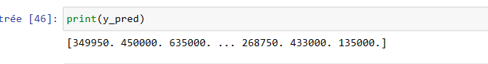
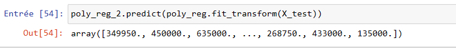
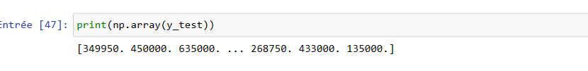

# Multiple_and_polynomial_regression
Comparison between multiple regression and polynomial regression

Pour comparer les résultats des modèles de régression multiple et de régression polynomiale, nous pouvons utiliser certaines mesures d'évaluation. Les mesures couramment utilisées pour les modèles de régression comprennent <b>l'erreur quadratique moyenne (MSE)</b>,<b> l'erreur quadratique moyenne racine (RMSE) </b>et <b>le coefficient de détermination (R^2)</b>.

<h3>Les résultats de y_pred de la RM</h3>

Voici déja le résultat de la régression multiple : 

<h3>Les résultats de y_pred de la RP</h3>

Voici également les résultation prédits par la regression polynomiale

<h3>Les résultat de y_test</h3>

<h3>Les résultats de RMSE et R-carré</h3>

